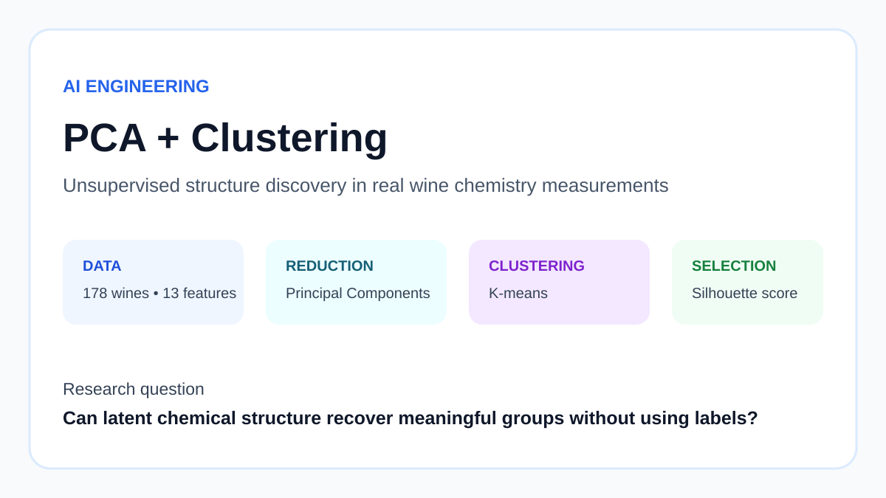
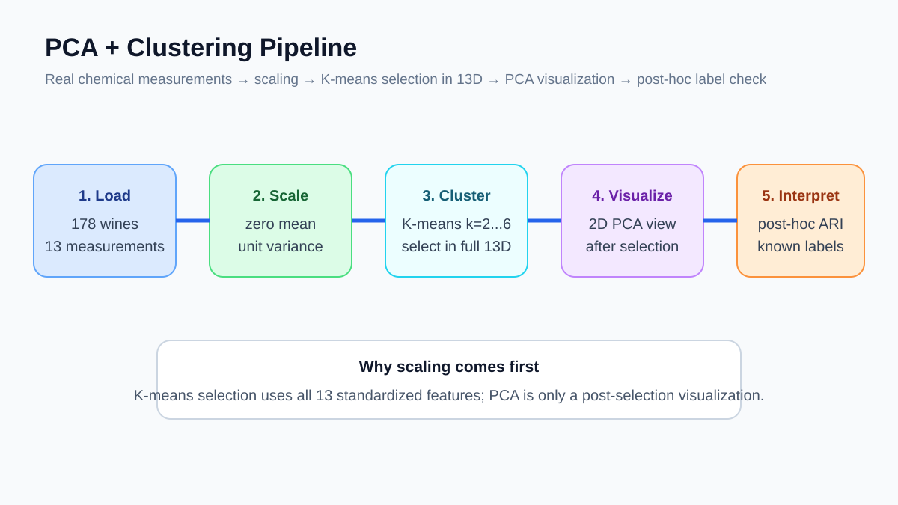
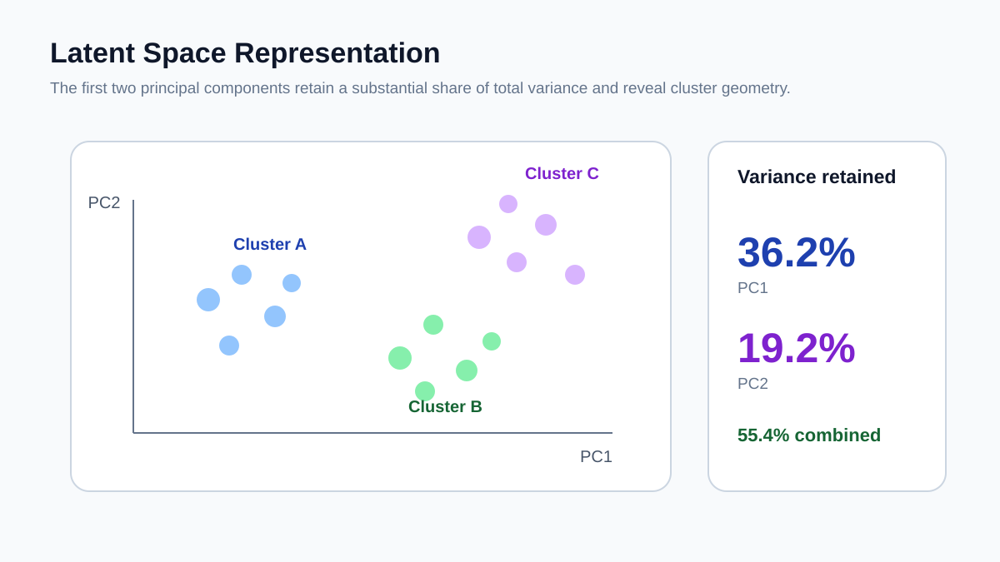
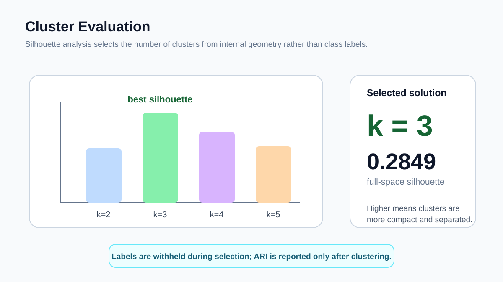

# PCA and K-Means Clustering

[](https://github.com/devissaputra/pca_clustering/actions/workflows/ci.yml)



An unsupervised-learning study that separates **model selection** from **visualization**: K-means is evaluated in the full standardized feature space, while PCA is used only to create an interpretable two-dimensional view.

## Question

> Do the 13 chemical measurements in the Wine Recognition dataset contain stable cluster structure without using the known wine-class labels?

## Data

- 178 wine samples
- 13 numerical chemical measurements
- 3 known classes, withheld during clustering

The known labels are not used to fit PCA, K-means, or choose the number of clusters.

## Method



1. standardize all 13 features;
2. fit K-means for `k = 2 ... 6` in the **full 13-dimensional standardized space**;
3. select `k` using silhouette score;
4. fit a 2-component PCA projection only for visualization;
5. after model selection is complete, compare cluster assignments with known classes using Adjusted Rand Index (ARI) as a post-hoc interpretation.

This avoids choosing clusters solely because they look separated in a two-dimensional projection.

## PCA view



The first two principal components explain:

- PC1: 36.20%
- PC2: 19.21%
- combined: 55.41%

The projection is useful for seeing structure, but it does not replace the full feature space.

## Recorded results



| Item | Result |
|---|---:|
| Selected `k` | **3** |
| Silhouette, full 13D space | **0.2849** |
| Silhouette of same labels in 2D PCA view | 0.5583 |
| Post-hoc ARI vs known classes | **0.8975** |
| Samples | 178 |

The large difference between the 13D and 2D silhouette scores is itself instructive: a low-dimensional projection can make separation look cleaner than it is in the original standardized space.

The high ARI is encouraging, but the true class labels were used only after clustering and never for model selection.

## Run

```bash
python -m venv .venv
source .venv/bin/activate
pip install -r requirements.txt
python src/run_experiment.py
```

Generated metrics and figures are saved under `results/`.

## Test

```bash
pip install pytest
pytest
```

Tests verify that the full-space silhouette score drives model selection, the known labels are used only for post-hoc evaluation, and the experiment is deterministic.

## Limits

K-means assumes roughly spherical groups under Euclidean distance. PCA is linear. A stronger extension would compare Gaussian mixtures, density-based clustering, stability under resampling, more than two visualization components, and alternative internal validation criteria.
