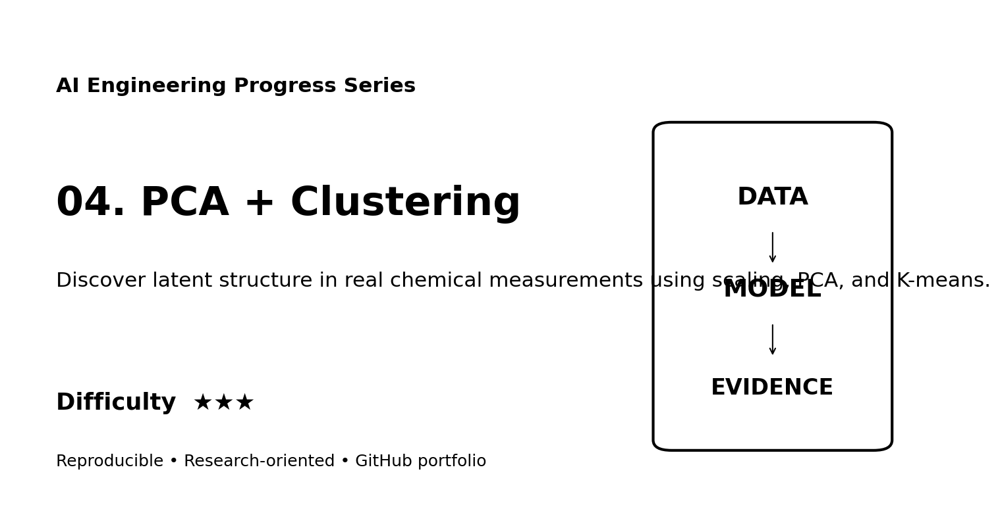
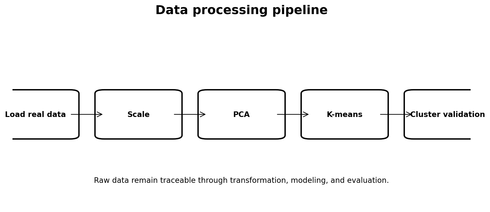
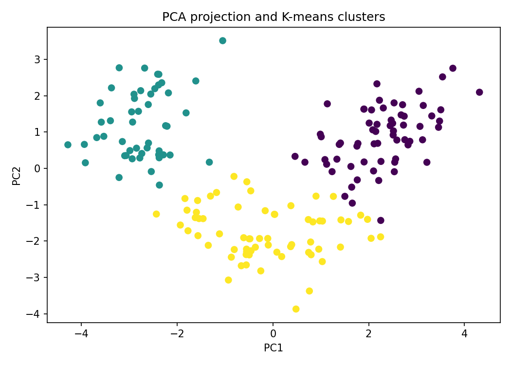
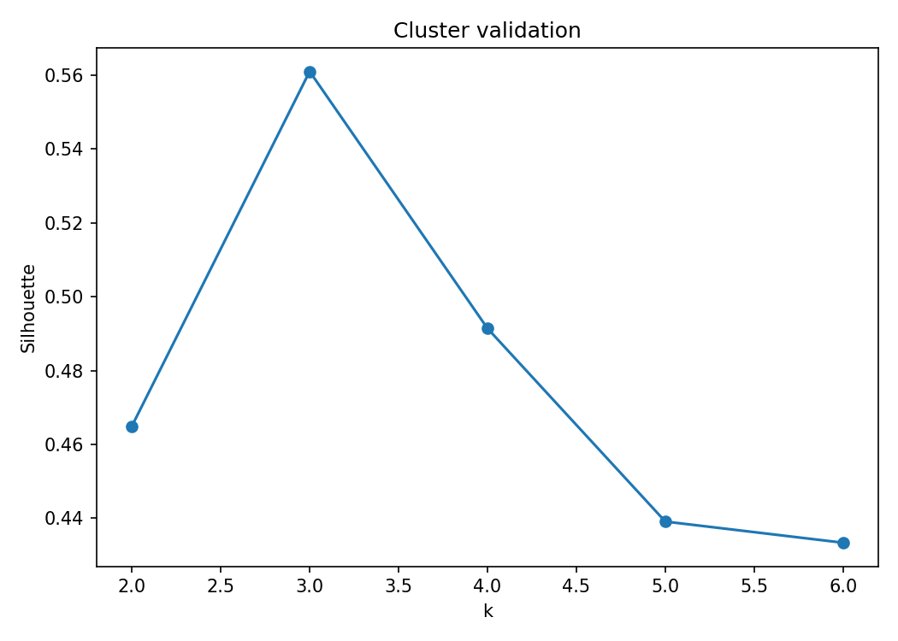

# 04. PCA + Clustering ★★★



> **Quick description:** Discover latent structure in real chemical measurements using scaling, PCA, and K-means.

## Why this project matters
This is a professor-readable AI Engineering project built around **real data**, an explicit processing mechanism, executable code, empirical evaluation, and a scientific-style technical report. It demonstrates **PCA, clustering, silhouette analysis, unsupervised learning** without hiding the data-processing choices inside an opaque notebook.

## Dataset
- **Dataset:** UCI Wine Recognition dataset via scikit-learn
- **Reference:** https://scikit-learn.org/stable/modules/generated/sklearn.datasets.load_wine.html
- **Data provenance and usage:** [`DATA.md`](DATA.md)

## Research pipeline


## Evidence gallery
| Data / model view | Evaluation / results |
|---|---|
|  |  |

These images are suitable for the corresponding project card/page on a web portfolio. The two lower figures are regenerated by the experiment when applicable.

## Reproduce
```bash
python -m venv .venv
source .venv/bin/activate   # Windows: .venv\Scripts\activate
pip install -r requirements.txt
python src/run_experiment.py
```

**Build status:** Executed successfully in the build environment. Metrics in `results/metrics.json` are generated from the stated real dataset.

## Results
Generated metrics:
```json
{
  "best_k": 3,
  "silhouette": 0.5610505693103247,
  "pc1_variance": 0.3619884809992633,
  "pc2_variance": 0.19207490257008944,
  "n": 178
}
```

## Research documentation
- [`paper/paper.md`](paper/paper.md) — scientific-style technical report
- [`QUICK_DESCRIPTION.md`](QUICK_DESCRIPTION.md) — short reusable project copy
- [`PORTFOLIO.md`](PORTFOLIO.md) — website-ready project card and gallery
- [`REPRODUCIBILITY.md`](REPRODUCIBILITY.md)
- [`ETHICS.md`](ETHICS.md)
- [`CITATION.cff`](CITATION.cff)

## Difficulty
**★★★** — intermediate

## Academic-integrity note
This repository is a research portfolio artifact, not a peer-reviewed publication. Reported metrics must come from `results/metrics.json` generated by the included code.
